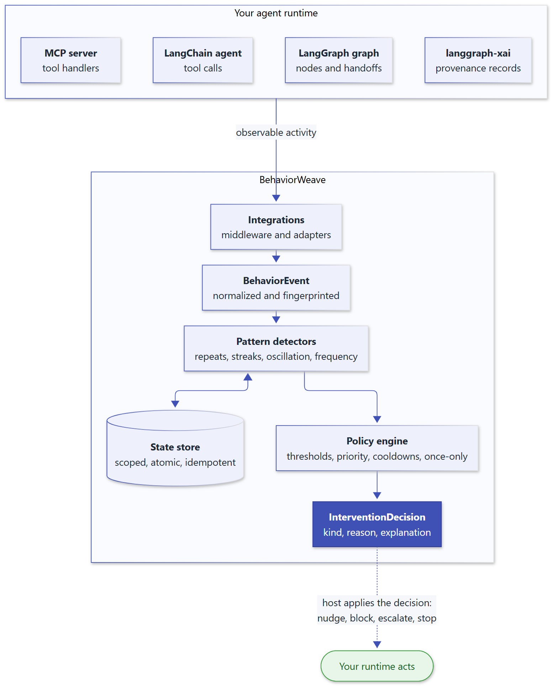

<div align="center">

# BehaviorWeave

**Deterministic behavioral policies and interventions for LangGraph and LangChain agents.**

[](https://github.com/smuniharish/behaviorweave/actions/workflows/ci.yml)
[](https://pypi.org/project/behaviorweave/)
[](https://pypi.org/project/behaviorweave/)
[](https://behaviorweave.readthedocs.io/en/latest/)
[](https://github.com/smuniharish/behaviorweave/actions/workflows/ci.yml)
[](https://github.com/smuniharish/behaviorweave/blob/master/LICENSE)

</div>

Agents loop. They call the same tool with the same arguments, retry a failing dependency,
bounce work between two agents, or press on through a failure streak. BehaviorWeave watches
observable runtime activity, detects these patterns deterministically, and returns a typed
intervention, such as *nudge*, *escalate*, *human review*, or *stop*, that your application
applies.

<p align="center">
  
</p>

## Highlights

- **Deterministic and explainable.** The same events always produce the same decision, with
  the pattern, count, threshold, and policy that caused it. No model calls, no heuristics.
- **One-line LangChain integration.** `BehaviorWeaveMiddleware` guards every tool call of a
  `create_agent` agent, including Deep Agents: it appends guidance, blocks `stop` decisions,
  and tracks failures.
- **Built for real agent failure modes.** Repeated tool calls, node loops, failure and retry
  streaks, delegation churn, and agents handing work back and forth.
- **Correct under concurrency.** Scope isolation, idempotent redelivery, and atomic state
  transitions; a once-only policy fires exactly once even when workers race.
- **Your runtime stays in control.** The engine returns decisions; it never stops, reroutes,
  or mutates your graph. The optional middleware refuses tool calls only for the
  intervention kinds you configure.
- **Fast and lean.** Pure-Python core with no framework imports, tens of thousands of events
  per second, and bounded memory. Fully typed, with 100% test coverage including
  property-based tests.

## Installation

```bash
pip install behaviorweave
```

or `uv add behaviorweave`. BehaviorWeave supports Python 3.12, 3.13, and 3.14.

## Quickstart

```python
from behaviorweave import (
    BehaviorEngine,
    BehaviorEvent,
    InterventionType,
    PolicyRule,
)

engine = BehaviorEngine(
    policies=[
        PolicyRule("repeat-nudge", "repeated_tool_call", 2, InterventionType.NUDGE),
        PolicyRule("repeat-stop", "repeated_tool_call", 3, InterventionType.STOP),
    ]
)

kinds = []
for _ in range(3):
    decision = engine.process(
        BehaviorEvent.tool_call("get_alarm", {"machine": "ETCH-3"}, scope="incident-42")
    )
    kinds.append(decision.intervention.kind.value)

print(kinds)  # ['noop', 'nudge', 'stop']
print(decision.intervention.reason)  # 'get_alarm' occurred 3 consecutive times
```

### Guard a LangChain agent

<!-- skip-snippet: requires a provider-backed chat model -->
```python
from langchain.agents import create_agent

from behaviorweave.integrations.langchain import BehaviorWeaveMiddleware

agent = create_agent(
    "openai:gpt-4.1-mini",
    tools=[get_alarm],
    middleware=[BehaviorWeaveMiddleware(engine)],
)
agent.invoke(
    {"messages": [{"role": "user", "content": "Inspect ETCH-3."}]},
    config={"configurable": {"thread_id": "incident-42"}},
)
```

The second identical call returns the tool result with
`[BehaviorWeave:nudge] ...` appended; the third is blocked before the tool runs.

## Built-in patterns

| Pattern ID | Detects |
| --- | --- |
| `repeated_tool_call` | Consecutive calls to the same tool with the same arguments. |
| `repeated_node_execution` | Consecutive executions of the same graph node. |
| `failure_streak` | Consecutive failures, reset by a success. |
| `retry_streak` | Consecutive retries, reset by a success. |
| `success_streak` | Consecutive successes, reset by a failure or retry. |
| `delegation_streak` | Consecutive delegations to the same agent. |
| `oscillation` | Handoffs or delegations bouncing back and forth between two agents. |
| `event_frequency` | Total occurrences of each event identity. |

Policies map these patterns to interventions (`nudge`, `warning`, `redirect`, `retry`,
`escalate`, `human_review`, `force_synthesis`, `pause`, `stop`, or `custom`) with
thresholds, priorities, per-policy cooldowns, and once-only semantics. You can also configure
your own instances of the pattern classes or implement the `Pattern` protocol.

## Integrations

| Framework | Integration |
| --- | --- |
| LangChain v1 | `BehaviorWeaveMiddleware` for `create_agent`, and `LangChainEventAdapter` |
| LangGraph | `LangGraphEventAdapter` for nodes, outcomes, handoffs, and delegation |
| langgraph-xai | Canonical provenance event mapping and graph instrumentation |
| MCP | Guard tools inside any MCP server |
| Deep Agents | Standard agent middleware |

## Examples

The [`examples/`](examples/) directory contains fifteen runnable scenarios that use a real,
OpenAI-compatible model: middleware guards, MCP, LangGraph loops, multi-agent delegation,
Swarm, Deep Agents, retry caps, oscillation, cooldowns, escalation ladders, concurrency, and a
provenance-linked audit with langgraph-xai.

## Agent Skill

The [`behaviorweave` Agent Skill](behaviorweave-skills/) teaches coding agents such as Claude
Code, Codex, Cursor, and GitHub Copilot to integrate, tune, and test BehaviorWeave. It follows
the [Agent Skills specification](https://agentskills.io/specification) and includes API
references, recipes, troubleshooting, an offline setup check, and a policy test template; see
[installation](https://behaviorweave.readthedocs.io/en/latest/agent-skills/).

## Documentation

Full documentation is at **[behaviorweave.readthedocs.io](https://behaviorweave.readthedocs.io/en/latest/)**:
[quickstart](https://behaviorweave.readthedocs.io/en/latest/quickstart/),
[concepts](https://behaviorweave.readthedocs.io/en/latest/events/),
[integrations](https://behaviorweave.readthedocs.io/en/latest/integrations/langchain/),
[API reference](https://behaviorweave.readthedocs.io/en/latest/api-reference/), and
[architecture](https://behaviorweave.readthedocs.io/en/latest/architecture/overview/).
Release notes and upgrade guidance are in [CHANGELOG.md](CHANGELOG.md).

## Contributing and security

Contributions are welcome; see [CONTRIBUTING.md](CONTRIBUTING.md) and the
[Code of Conduct](CODE_OF_CONDUCT.md). Please report vulnerabilities privately as described
in [SECURITY.md](SECURITY.md).

## License

Apache License 2.0. See [LICENSE](LICENSE).
