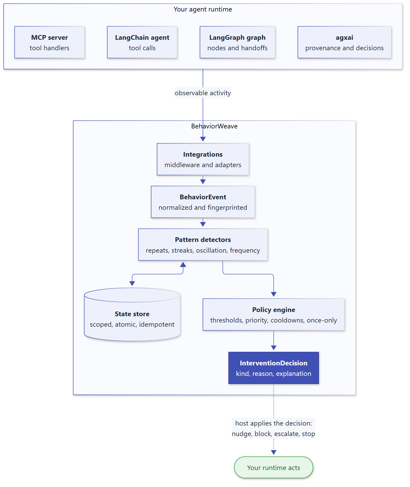

<div align="center">

# BehaviorWeave

**Async behavioral policies and interventions for LangGraph and LangChain agents.**

[](https://github.com/smuniharish/behaviorweave/actions/workflows/ci.yml)
[](https://pypi.org/project/behaviorweave/)
[](https://pypi.org/project/behaviorweave/)
[](https://behaviorweave.readthedocs.io/en/latest/)
[](https://github.com/smuniharish/behaviorweave/blob/master/LICENSE)

</div>

Agents repeat tool calls, retry failing dependencies, and bounce work between specialists.
BehaviorWeave detects these patterns deterministically and returns typed interventions:
your application decides when to nudge, escalate, request review, or stop.



## Highlights

- **Deterministic and explainable:** pattern, count, threshold, policy, and provenance;
  no model call is needed to evaluate a policy.
- **Async-first:** engine, storage, audit, and lifecycle operations are awaitable.
- **LangChain middleware:** guard `create_agent` and Deep Agents tool calls; scope by thread,
  append guidance, block configured kinds, and track outcomes.
- **Customizable:** ABCs for patterns, stores, and sinks; inject every agxai capability,
  plugin, configuration, and exporter.
- **Durable history:** LangGraph BaseStore adapter and PostgreSQL/Redis reference stores;
  persisted middleware halts and reusable conformance tests.
- **Reliable:** scope isolation, idempotent redelivery, atomic state transitions, and
  100% source line and branch coverage.

## Install

```bash
pip install behaviorweave
```

Or `uv add behaviorweave`. Supports Python 3.12 through 3.15.

## Quickstart

```python
import asyncio
from behaviorweave import BehaviorEngine, BehaviorEvent, InterventionType, PolicyRule


async def main():
    async with BehaviorEngine(
        policies=[
            PolicyRule("nudge", "repeated_tool_call", 2, InterventionType.NUDGE),
            PolicyRule("stop", "repeated_tool_call", 3, InterventionType.STOP),
        ]
    ) as engine:
        kinds = []
        for _ in range(3):
            decision = await engine.process(
                BehaviorEvent.tool_call("get_alarm", {"machine": "ETCH-3"}, scope="incident-42")
            )
            kinds.append(decision.intervention.kind.value)
        print(kinds)  # ['noop', 'nudge', 'stop']


asyncio.run(main())
```

### Guard a LangChain agent

<!-- skip-snippet: requires a configured provider-backed model and application tools -->
```python
from langchain.agents import create_agent
from behaviorweave.integrations.langchain import BehaviorWeaveMiddleware

agent = create_agent(model, tools=[get_alarm], middleware=[BehaviorWeaveMiddleware(engine)])
result = await agent.ainvoke(
    {"messages": [{"role": "user", "content": "Inspect ETCH-3."}]},
    config={"configurable": {"thread_id": "incident-42"}},
)
```

The second identical call receives `[BehaviorWeave:nudge]` guidance. The third is blocked
before the tool runs. The engine returns decisions; enforcement belongs to the middleware
or your host application.

## Built-in patterns

| Pattern | Detects |
| --- | --- |
| `repeated_tool_call` | Consecutive identical tool calls. |
| `repeated_node_execution` | Consecutive executions of one node. |
| `failure_streak`, `retry_streak`, `success_streak` | Consecutive outcomes. |
| `delegation_streak` | Repeated delegation to one agent. |
| `oscillation` | Back-and-forth handoffs or delegations. |
| `event_frequency` | Total occurrences of each event identity. |

Policies select thresholds, priorities, per-policy cooldowns, once-only behavior, and
intervention kinds. Configure the built-in pattern classes or subclass the `Pattern` ABC.

## Integrations and customization

| Surface | Available customization |
| --- | --- |
| LangChain | Scope, block kinds, sync/async decision hook, formatter, middleware name. |
| LangGraph | Host-owned routing/checkpoints, event adapters, BaseStore namespace and TTL. |
| agxai | Config, registry, identity, plugins, custom capture, store, exporter, attribution, explanation, disclosure and capture policies. |
| Audit | Async `AuditSink`, in-memory sink, and `AgxaiAuditSink` for semantic decisions. |
| Storage | Async `BehaviorStateStore` ABC and PostgreSQL/Redis reference implementations. |
| MCP / Swarm / Deep Agents | Guards at real tool, delegation, and handoff boundaries. |

See the [downstream inventory](https://behaviorweave.readthedocs.io/en/latest/integrations/compatibility/).
agxai is used for provenance and explanations; BehaviorWeave owns behavioral decisions.

## Examples and Agent Skills

The [nineteen async examples](https://github.com/smuniharish/behaviorweave/tree/master/examples)
cover middleware, MCP, graph loops, Swarm, Deep Agents, concurrent runs, durable databases,
agxai semantic audit, and OpenTelemetry. Configure model credentials through environment
variables; database/OTel examples support local Podman services.

The [Agent Skills](https://github.com/smuniharish/behaviorweave/tree/master/behaviorweave-skills)
teach agents how to integrate and extend the package, with executable checks and evaluations.

## Documentation and project

- [Quickstart](https://behaviorweave.readthedocs.io/en/latest/getting-started/quickstart/)
- [Concepts](https://behaviorweave.readthedocs.io/en/latest/guide/concepts/events/)
- [Integrations](https://behaviorweave.readthedocs.io/en/latest/integrations/langchain/)
- [API reference](https://behaviorweave.readthedocs.io/en/latest/api/)
- [Changelog](https://github.com/smuniharish/behaviorweave/blob/master/CHANGELOG.md)
- [Contributing](https://github.com/smuniharish/behaviorweave/blob/master/CONTRIBUTING.md)
- [Code of Conduct](https://github.com/smuniharish/behaviorweave/blob/master/CODE_OF_CONDUCT.md)
- [Security](https://github.com/smuniharish/behaviorweave/blob/master/SECURITY.md)

Apache License 2.0. See [LICENSE](https://github.com/smuniharish/behaviorweave/blob/master/LICENSE).
