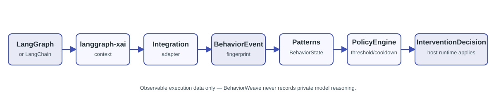

# Architecture overview

The lifecycle is explicit:

`BehaviorEvent` is an immutable normalized observation. Pattern detectors answer
what is happening; policies answer what should happen; interventions are decisions
that the host applies. State is keyed by `(scope, pattern, fingerprint)` and is
isolated per `BehaviorEngine` instance.

The mandatory `langgraph-xai` dependency supplies explainability/provenance context.
BehaviorWeave stores only a reference to that context and observable metadata; it
does not recreate provenance or record private model reasoning.

## Live host boundary

The real examples wrap actual LangChain tool callables. Immediately before the tool
body executes, the wrapper emits a `BehaviorEvent`; immediately after policy evaluation,
the intervention is returned in the tool result for the agent to follow. No provider
credential, model response, or private reasoning is persisted by BehaviorWeave.
