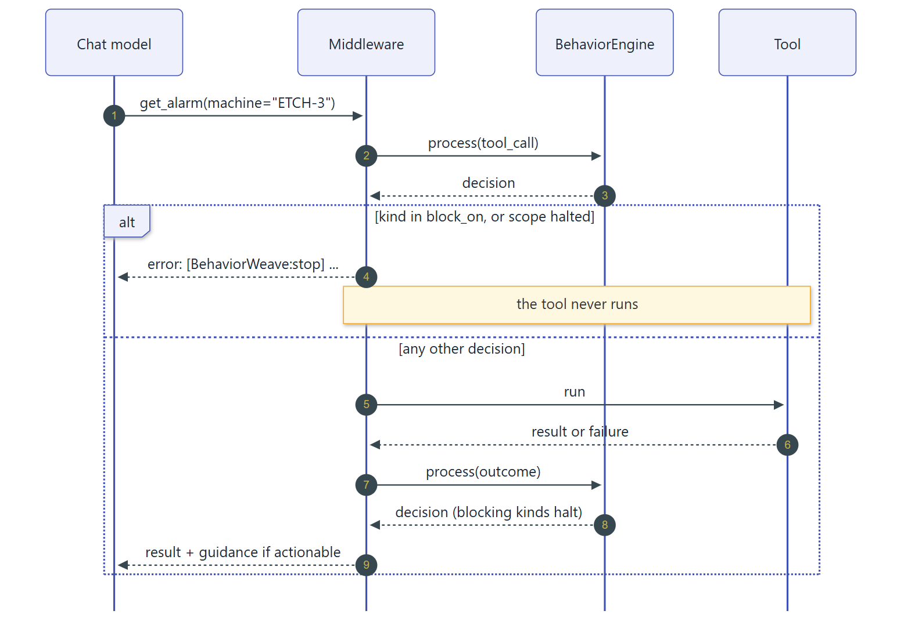

# LangChain

BehaviorWeave integrates with LangChain v1 through public APIs only. It never
monkey-patches LangChain.

## BehaviorWeaveMiddleware

[`BehaviorWeaveMiddleware`][behaviorweave.integrations.langchain.BehaviorWeaveMiddleware] is
a LangChain agent middleware that guards every tool call of a `create_agent` agent:



1. Before the tool runs, it reports a `tool_call` event and evaluates your policies.
2. If the decision's kind is in `block_on` (`stop` and `pause` by default), or the scope is
   [halted](#halts), the tool does not run. The model receives an error result containing
   the guidance, so it knows why.
3. Otherwise the tool runs, and guidance for any other actionable decision is appended to
   the tool result.
4. With `track_outcomes=True` (the default), the result is recorded as a `success` or
   `failure` outcome, which drives `failure_streak`, `success_streak`, and `retry_streak`.

<!-- skip-snippet: requires a provider-backed chat model -->
```python
from langchain.agents import create_agent
from langchain.tools import tool

from behaviorweave import BehaviorEngine, InterventionType, PolicyRule
from behaviorweave.integrations.langchain import BehaviorWeaveMiddleware


@tool
def get_alarm(machine: str) -> str:
    """Return the current alarm for a machine."""
    return f"{machine}: chamber-pressure warning"


engine = BehaviorEngine(
    policies=[
        PolicyRule(
            "repeat-nudge",
            "repeated_tool_call",
            2,
            InterventionType.NUDGE,
            message="Reuse the alarm you already fetched.",
        ),
        PolicyRule(
            "repeat-stop",
            "repeated_tool_call",
            3,
            InterventionType.STOP,
            message="Identical call blocked.",
        ),
        PolicyRule(
            "outage",
            "failure_streak",
            3,
            InterventionType.ESCALATE,
            message="This tool keeps failing; report an outage.",
        ),
    ]
)
agent = create_agent(
    model, [get_alarm], middleware=[BehaviorWeaveMiddleware(engine)]
)
agent.invoke(
    {"messages": [{"role": "user", "content": "Inspect ETCH-3."}]},
    config={"configurable": {"thread_id": "incident-42"}},
)
```

A guarded transcript looks like this:

```text
-> get_alarm({'machine': 'ETCH-3'})
   ETCH-3: chamber-pressure warning
-> get_alarm({'machine': 'ETCH-3'})
   ETCH-3: chamber-pressure warning
   [BehaviorWeave:nudge] Reuse the alarm you already fetched.
-> get_alarm({'machine': 'ETCH-3'})
   [BehaviorWeave:stop] Identical call blocked.
```

### Options

| Option | Default | Purpose |
| --- | --- | --- |
| `scope` | LangGraph `thread_id` | A fixed scope string, or a callable that derives the scope from the `ToolCallRequest`. Without either, the run must provide a `thread_id`. |
| `block_on` | `stop`, `pause` | Intervention kinds that prevent tool calls from running. See [Halts](#halts) for decisions triggered by outcomes. |
| `track_outcomes` | `True` | Record tool results as `success` or `failure` outcomes. |
| `on_decision` | `None` | Hook receiving every decision and its event; raise from it, or call `interrupt()`, to stop or pause the run. |
| `formatter` | `default_guidance` | Renders a decision as text for the model. |
| `name` | class name | Set when one agent uses several instances. |

### Human approval

To require a reviewer's approval, call LangGraph's `interrupt()` from `on_decision` and
compile the agent with a checkpointer:

```python
from langgraph.types import interrupt

from behaviorweave import (
    BehaviorEngine,
    BehaviorEvent,
    InterventionDecision,
    InterventionType,
    PolicyRule,
)
from behaviorweave.integrations.langchain import BehaviorWeaveMiddleware


class Rejected(Exception):
    """Raised when a reviewer rejects a tool call."""


def require_approval(
    decision: InterventionDecision, event: BehaviorEvent
) -> None:
    if decision.intervention.kind is not InterventionType.HUMAN_REVIEW:
        return
    if interrupt({"reason": decision.intervention.reason}) != "approve":
        raise Rejected(decision.intervention.reason)


engine = BehaviorEngine(
    policies=[
        PolicyRule(
            "confirm-repeat",
            "repeated_tool_call",
            2,
            InterventionType.HUMAN_REVIEW,
        )
    ]
)
middleware = BehaviorWeaveMiddleware(engine, on_decision=require_approval)
```

When a `human_review` decision arrives, the run pauses. Resume it with
`agent.invoke(Command(resume="approve"), config)` to run the tool; any other answer raises
`Rejected`. On resume, LangGraph re-executes the tool step and BehaviorWeave returns the
original decision, so the hook runs again and `interrupt()` returns the reviewer's answer.
Do not skip duplicate decisions in such a hook.

### Halts

A tool's outcome is known only after the tool ran, so an outcome decision whose kind is in
`block_on`, such as `failure_streak` reaching a `stop` threshold, cannot refuse that call.
Instead, the middleware *halts* the scope: every later tool call in that scope is refused
with the decision's guidance until you lift the halt.

```python
middleware.release("incident-42")  # True if the scope was halted
```

Halts are kept in memory by the middleware instance, for up to 10,000 scopes, and reset when
the process restarts. For advisory outcome policies, such as escalating a failure streak to
an operator, use a kind outside `block_on`.

To pause the run for an operator as well, call `interrupt()` from `on_decision`, and lift the
halt from your application, before resuming the run, when the operator approves:

```python
def pause_for_operator(
    decision: InterventionDecision, event: BehaviorEvent
) -> None:
    if decision.intervention.kind is InterventionType.PAUSE:
        interrupt({"reason": decision.intervention.reason})
```

<!-- skip-snippet: resumes a paused agent run -->
```python
from langgraph.types import Command

middleware.release("incident-42")  # the operator approved
agent.invoke(Command(resume="approved"), config)
```

Resuming re-runs the interrupted step, so the tool runs again. The halt never blocks the call
that created it, and the call's new outcome is handled like any other: if the tool fails
again, the redelivered outcome repeats the pause decision, so `interrupt()` returns the
operator's answer and the released halt is not restored; if the tool now succeeds, the
success is recorded. Release the halt from your application rather than from the hook,
because the hook receives the pause decision again only when the outcome repeats. To keep
refusing the scope's tool calls, resume without releasing the halt.

### Behavior details

- **Replays and resumes.** A replayed or resumed graph step reuses its tool-call ID, so
  BehaviorWeave recognizes the redelivery: the call is not counted again, and an actionable
  decision is repeated, so blocking and `on_decision` apply as they did the first time. The
  tool itself runs again, and its outcome is a redelivery only if it repeats: a replayed call
  that now succeeds where it failed, or fails where it succeeded, records its new outcome.
  Providers that reuse call IDs across turns are handled too.
- **Errors.** A tool returning an error `ToolMessage` is recorded as a failure. A tool that
  raises is recorded as a failure and the exception propagates; set
  `handle_tool_error=True` on the tool to return errors to the model instead. If a failed
  call is retried and succeeds, the success is recorded as well.
- **Interrupts.** LangGraph interrupts and parent-graph commands raised inside a tool
  propagate unchanged and are not recorded as outcomes; the outcome is recorded when the
  resumed tool finishes.
- **`Command` results.** Results that are `Command` objects, such as handoff tools, are
  returned unchanged. Blocking still applies, which is how you stop runaway handoffs.
- **Async.** `ainvoke` and `astream` use the same logic through `awrap_tool_call`.

## LangChainEventAdapter

When you control the tool lifecycle yourself, such as in a callback handler or a custom
retry loop, build events with
[`LangChainEventAdapter`][behaviorweave.integrations.langchain.LangChainEventAdapter]:

```python
from behaviorweave import BehaviorEngine, InterventionType, PolicyRule
from behaviorweave.integrations.langchain import LangChainEventAdapter

adapter = LangChainEventAdapter()
engine = BehaviorEngine(
    policies=[PolicyRule("cap", "retry_streak", 3, InterventionType.STOP)]
)

for attempt in range(1, 10):
    decision = engine.process(
        adapter.retry(scope="order-7", tool_name="charge_card")
    )
    if decision.intervention.kind.is_terminal:
        break
print(attempt)  # 3
```

| Method | Event |
| --- | --- |
| `tool_start(tool_name, *, scope, arguments=None, event_id=None)` | `tool_call` |
| `tool_end(*, scope, tool_name=None, event_id=None)` | `success` outcome |
| `tool_error(*, scope, error_type, tool_name=None, event_id=None)` | `failure` outcome |
| `retry(*, scope, tool_name=None, event_id=None)` | `retry` |
