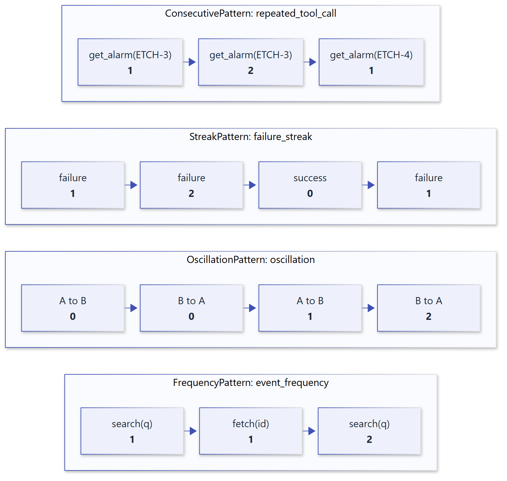

# Patterns

A pattern answers *what is happening*. It matches events, advances its own scoped state
atomically, and reports a count. Patterns never decide what to do; [policies](policies.md)
do.

## Built-in patterns

The engine provides these patterns by default. Only patterns referenced by at least one
policy are evaluated, so unused patterns cost nothing and keep no state.

| Pattern ID | Class | Observes | Count means |
| --- | --- | --- | --- |
| `repeated_tool_call` | `ConsecutivePattern` | `tool_call` | Consecutive calls with the same tool and arguments. |
| `repeated_node_execution` | `ConsecutivePattern` | `node_execution` | Consecutive executions of the same node. |
| `failure_streak` | `StreakPattern` | events with an outcome | Consecutive failures; a success resets it. |
| `retry_streak` | `StreakPattern` | events with an outcome, `retry` events | Consecutive retries; a success resets it. |
| `success_streak` | `StreakPattern` | events with an outcome | Consecutive successes; a failure or retry resets it. |
| `delegation_streak` | `ConsecutivePattern` | `delegation` | Consecutive delegations to the same agent. |
| `oscillation` | `OscillationPattern` | `agent_handoff`, `delegation` | Consecutive back-and-forth transitions between two agents. |
| `event_frequency` | `FrequencyPattern` | all event types | Total occurrences of each identity in the scope. |



## Pattern families

**Consecutive.** The count grows while the same [identity](events.md#identity-and-fingerprints)
repeats and restarts at 1 when a different identity arrives.

**Streak.** The count grows with each outcome in `counts`, restarts at 0 on an outcome in
`resets`, and ignores everything else. Streaks are scope-wide: failures of different tools in
one conversation form one failure streak. A `retry` event without an explicit outcome counts
as a retry, so retry signals from adapters and outcome events combine into one streak.

**Oscillation.** The count grows each time an event returns to the identity seen two events
earlier while differing from the previous one. `A, B, A` is one transition back; `A, B, A, B`
is two. Any other event resets the count to 0.

**Frequency.** The count never resets: it is the number of times an identity has occurred in
the scope, tracked separately per identity and event type.

```python
from behaviorweave import (
    BehaviorEngine,
    BehaviorEvent,
    EventType,
    InterventionType,
    PolicyRule,
)

engine = BehaviorEngine(
    policies=[
        PolicyRule("ping-pong", "oscillation", 2, InterventionType.WARNING)
    ]
)
hops = [
    ("triage", "billing"),
    ("billing", "triage"),
    ("triage", "billing"),
    ("billing", "triage"),
]
kinds = [
    engine.process(
        BehaviorEvent(
            EventType.AGENT_HANDOFF, scope="s", agent_name=a, target_agent=b
        )
    ).intervention.kind.value
    for a, b in hops
]
print(kinds)  # ['noop', 'noop', 'noop', 'warning']
```

## Configuring your own instances

The pattern classes are public. Instantiate them with your own IDs and event types, and pass
them to the engine together with any built-ins you still need:

```python
from behaviorweave import (
    ConsecutivePattern,
    OscillationPattern,
    built_in_patterns,
)

node_ping_pong = OscillationPattern(
    "node_ping_pong", frozenset({EventType.NODE_EXECUTION})
)
engine = BehaviorEngine(
    patterns=[*built_in_patterns(), node_ping_pong],
    policies=[
        PolicyRule("node-loop", "node_ping_pong", 3, InterventionType.REDIRECT)
    ],
)
```

Passing `patterns=[...]` replaces the built-in set; passing an empty list provides no
patterns at all. To write a detector from scratch, implement the
[`Pattern`][behaviorweave.Pattern] protocol; see [Custom patterns](guides/custom-patterns.md).

## Deterministic by design

Fingerprints are structural, not semantic: `search("pressure drift")` and
`search("drift in pressure")` are different calls. This keeps every decision reproducible
and explainable. If your application needs looser matching, normalize arguments before
reporting the event or set an explicit `fingerprint`.
