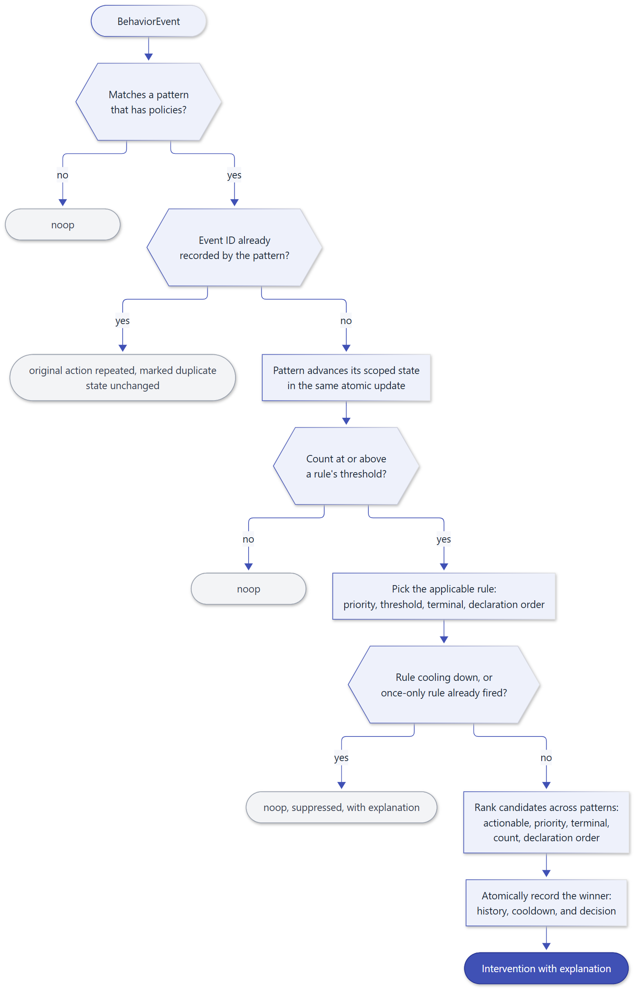
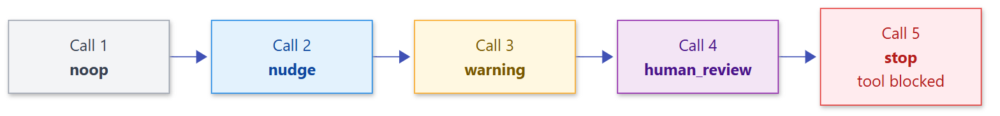

# Policies and decisions

A policy answers *what should happen*. A [`PolicyRule`][behaviorweave.PolicyRule] maps a
pattern count to an intervention, and the engine turns every event into exactly one
[`InterventionDecision`][behaviorweave.InterventionDecision].

## Policy rules

```python
from datetime import timedelta

from behaviorweave import (
    BehaviorEngine,
    BehaviorEvent,
    InterventionType,
    PolicyRule,
)

rule = PolicyRule(
    policy_id="repeat-nudge",  # unique, recorded in every decision
    pattern_id="repeated_tool_call",  # the pattern it governs
    threshold=2,  # applies when the pattern count is >= 2
    intervention=InterventionType.NUDGE,
    priority=0,  # higher wins among applicable rules
    cooldown=timedelta(minutes=5),  # optional quiet period after it fires
    once_only=False,  # fire at most once per pattern history
    message="Reuse the result you already have.",
    severity="info",  # free-form label copied to the intervention
)
```

Rules are validated when they are created: thresholds must be at least 1, a rule cannot
request `noop`, and cooldowns must be positive. The engine also rejects duplicate policy IDs
and policies that reference unknown patterns.

## Interventions

| `InterventionType` | Typical host action |
| --- | --- |
| `noop` | Continue. |
| `nudge` | Append guidance to the tool result or next prompt. |
| `warning` | Warn the agent or operator. |
| `redirect` | Route to a different node, agent, or strategy. |
| `retry` | Retry the current unit of work. |
| `escalate` | Hand over to a supervisor agent or an operator. |
| `human_review` | Require a human decision before continuing. |
| `force_synthesis` | Stop gathering information and answer from existing evidence. |
| `pause` | Suspend execution until resumed. Terminal. |
| `stop` | End execution. Terminal. |
| `custom` | Application-defined. |

`InterventionType.is_terminal` is `True` for `stop` and `pause`.

## How a decision is made



**Within one pattern**, the applicable rule with the highest `priority` wins; ties go to the
higher `threshold`, then to terminal interventions, then to the rule declared first. This
makes escalation ladders natural:



```python
engine = BehaviorEngine(
    policies=[
        PolicyRule("nudge", "repeated_tool_call", 2, InterventionType.NUDGE),
        PolicyRule(
            "warning", "repeated_tool_call", 3, InterventionType.WARNING
        ),
        PolicyRule(
            "review", "repeated_tool_call", 4, InterventionType.HUMAN_REVIEW
        ),
        PolicyRule("stop", "repeated_tool_call", 5, InterventionType.STOP),
    ]
)
ladder = [
    engine.process(
        BehaviorEvent.tool_call("report", scope="s")
    ).intervention.kind.value
    for _ in range(5)
]
print(ladder)  # ['noop', 'nudge', 'warning', 'human_review', 'stop']
```

**Across patterns**, when one event triggers several patterns, the engine returns the
strongest decision: actionable over `noop`, then higher `priority`, then terminal
interventions, then the higher pattern count, then the pattern declared first. Only the
returned decision is recorded against cooldowns and once-only history.

## Cooldowns and once-only

A `cooldown` silences a policy for a period after it fires, measured in event time. It
applies to that policy alone, so an escalation rule still fires while a nudge is cooling
down:

```python
engine = BehaviorEngine(
    policies=[
        PolicyRule(
            "nudge",
            "repeated_tool_call",
            2,
            InterventionType.NUDGE,
            cooldown=timedelta(hours=1),
        ),
        PolicyRule("stop", "repeated_tool_call", 4, InterventionType.STOP),
    ]
)
decisions = [
    engine.process(BehaviorEvent.tool_call("sync", scope="s")) for _ in range(4)
]
print(
    [d.intervention.kind.value for d in decisions]
)  # ['noop', 'nudge', 'noop', 'stop']
print(decisions[2].suppressed)  # True
```

`once_only=True` makes a policy fire at most once per pattern history. Both settings are
tracked per pattern history: per scope for consecutive, streak, and oscillation patterns, and
per scope and identity for `event_frequency`. A withheld rule produces a `noop` decision
with `suppressed=True` and an explanation of why; a lower-precedence rule does not fire in its
place.

## Reading a decision

| Field | Meaning |
| --- | --- |
| `intervention.kind` | The requested action. |
| `intervention.message` | The policy's instruction for the agent or operator. |
| `intervention.reason` | Deterministic description of the observed behavior. |
| `intervention.policy`, `.pattern`, `.scope`, `.severity` | Where the decision came from. |
| `explanation` | Pattern, count, threshold, policy, reason, and provenance reference. |
| `actionable` | `True` unless the kind is `noop`. |
| `suppressed` | A rule applied but was withheld by its cooldown or once-only setting. |
| `duplicate` | The event was a redelivery of an event a pattern already recorded: no state changed. An actionable decision is repeated; any other, including a suppressed one, comes back as a plain `noop`. |

## Auditing every decision

Pass an `audit_sink` to receive an immutable [`AuditRecord`][behaviorweave.AuditRecord]
for every processed event: the event, the deciding pattern, its state snapshot, and the
decision.

```python
records = []
engine = BehaviorEngine(
    policies=[
        PolicyRule("nudge", "repeated_tool_call", 2, InterventionType.NUDGE)
    ],
    audit_sink=records.append,
)
engine.process(BehaviorEvent.tool_call("sync", scope="s"))
print(records[0].decision.intervention.kind.value)  # noop
```
